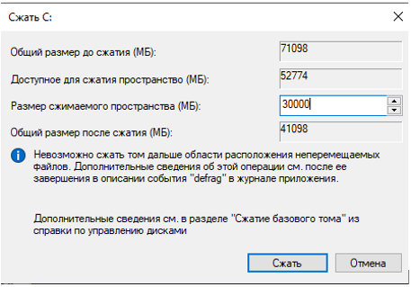
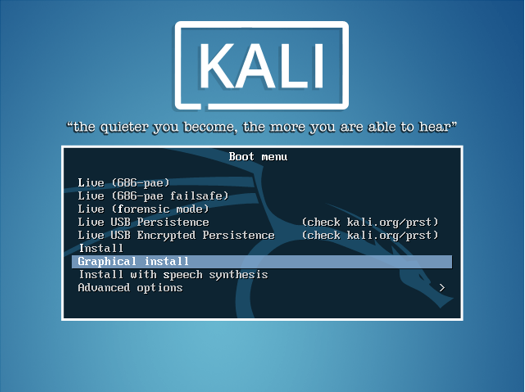
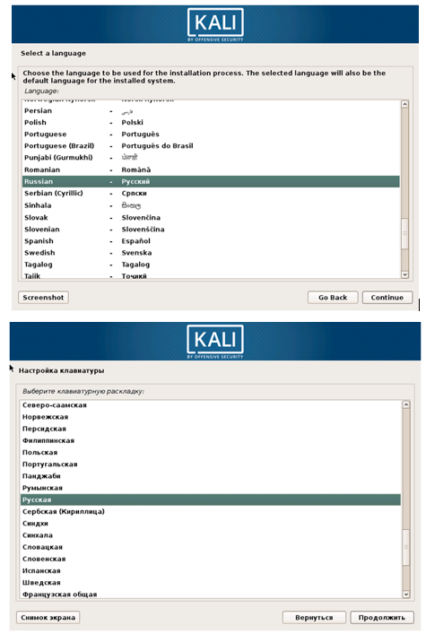
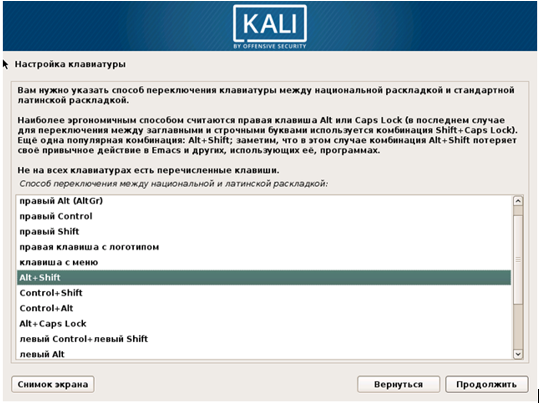
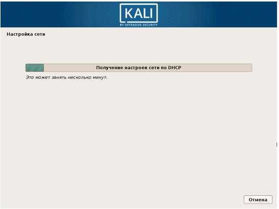

# Встановлення Kali Linux всередині Windows 10 без віртуальної машини

Підтримка та розвиток інформаційних ресурсів [ХНЕУ ім. С. Кузнеця](https://www.hneu.edu.ua/). Кафедра [кібербезпеки та інформаційних технологій](http://www.kafcbit.hneu.edu.ua/).

---
У даній статті буде розглянуто два способи установки самого популярного дистрибутива Linux для інформаційної безпеки - Kali Linux

## Підготовка до встановлення Kali Linux поруч з Windows 10

Kali Linux можна використовувати в якості додаткової системи, залишивши на ПК і Windows 10. Для цього потрібно встановити дистрибутив Kali разом з Windows.
Linux і Windows не можуть використовувати один і той же розділ. Тому для спільної установки буде потрібно виділити вільне місце для Kali Linux. Зробити це можна прямо з встановленої Windows 10.
Спочатку потрібно відкрити інструмент для управління Windows10 - наприклад, через правий клік по іконці комп'ютера на робочому столі.

*Рисунок 1 – Пошук інструмента управління дисками*

Перейдемо до меню управління дисковим простором у Windows 10

*Рисунок 2 – Меню управління дисками Win10*

Тепер потрібно вибрати «Стиснути том» для диска С: (на ньому стоїть Windows 10) з контекстного меню.

*Рисунок 3 – Том для стиснення*

Після пророблених нами дій відкриється вікно, в якому необхідно вказати розмір стискання. Для встановлення Linux дистрибутиву будє достатньо 20 або більше гігабайтів вільного місця, для комфортної роботи з системою ми обираємо 30 гігабайтів.

*Рисунок 4 – Стискаємо том*

Тепер ми маємо вільне місце для встановлення ОС, вільне місце в панелі управління відмічається чорним кольором та має характерний заголовок "Не розподілена".

*Рисунок 5 – Результат розподілення вільного місця під Kali Linux*

Тепер можна перезавантажуватися і запускати інсталятор Kali з флешки або з DVD.

## Встановлення на нерозподілене місце

Необхідно завантажитися з носія Kali Linux і вибрати пункт Graphical Install.

*Рисунок 6 – Меню встановлення*

Перейдемо до мовних налаштуваннь:

*Рисунок 7 – Мовні налаштування*

Та обираємо зручну для нас розкладку зміни мови клавіатури

*Рисунок 8 – Зміна розкладки*

Далі Linux налаштує мережу в автоматичному режимі :

*Рисунок 9 – Налаштування мережі*

Далі необхідно буде ввести пароль для суперкористувача Kali.

*Рисунок 10 – Встановлення паролю суперкористувача *

