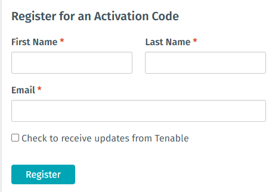
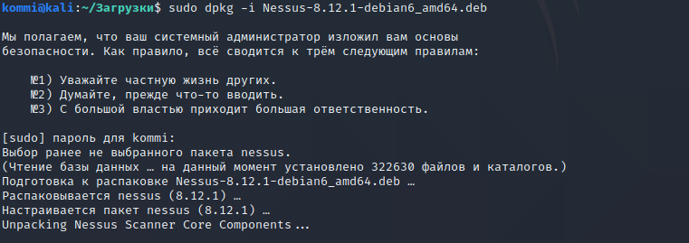
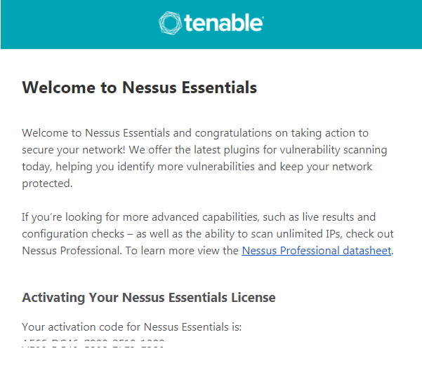
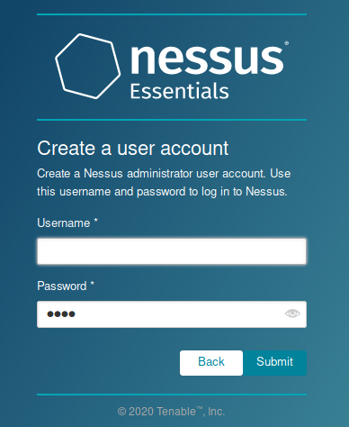
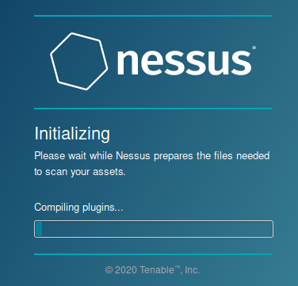
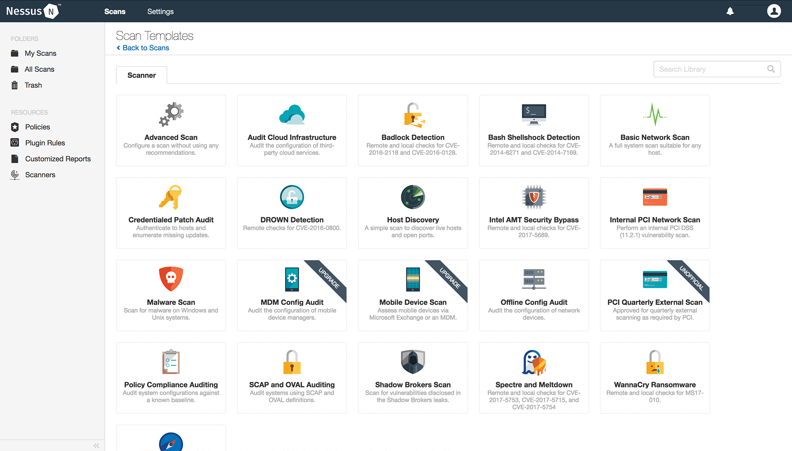
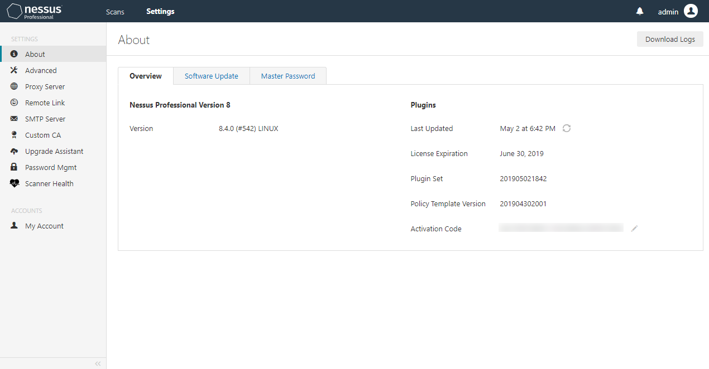
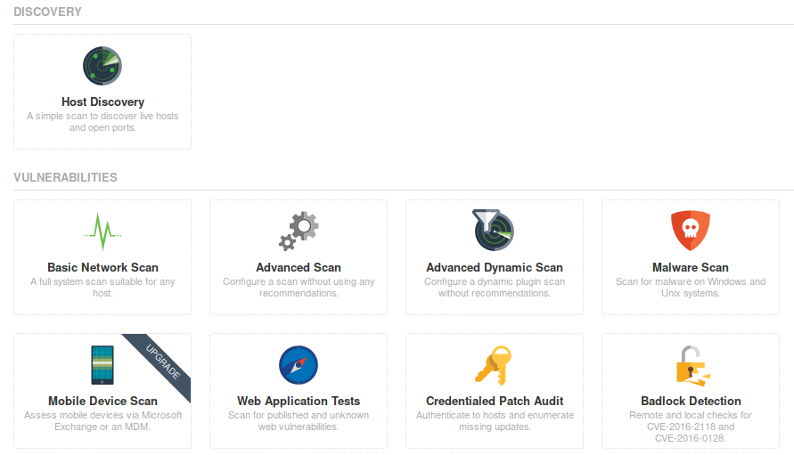

# Встановлення та використання сканеру вразливостей Nessus до Kali Linux

Підтримка та розвиток інформаційних ресурсів [ХНЕУ ім. С. Кузнеця](https://www.hneu.edu.ua/). Кафедра [кібербезпеки та інформаційних технологій](http://www.kafcbit.hneu.edu.ua/).

---
## Вступ 

У даній статті буде розглянуто сканер вразливостей Nessus  в умовах операційної системи Kali Linux

Nessus - програма для автоматичного пошуку відомих вад в захисті інформаційних систем. Nessus є одним з багатьох сканерів вразливостей, які використовуються під час оцінок вразливостей і тестування на проникнення, включаючи шкідливі атаки.

Вона здатна виявити найбільш часто зустрічаються види вразливостей, наприклад:

*Наявність вразливих версій служб або доменів
*Помилки в конфігурації (наприклад, відсутність необхідності авторизації на SMTP-сервері)
*Наявність паролів за замовчуванням, порожніх, або слабких паролів

Програма має клієнт-серверну архітектуру, що сильно розширює можливості сканування.

Для початку потрібно завантажити образ для вашої операційної системи, це можна зробити на офіційному сайті програми, для цього потрібно вказати свої контакти в спеціальній формі:

Перейдемо до процедури встановлення Nessus до Kali Linux, для цього нам потрібно перейти до місця, куди було завантажено образ програми за допомогою команди dpkg –i:

В разі вдалого встановлення, командна строка сама запропонує необхідні команди для запуску  Nessus.

На даному етапі нам потрібно обрати версію програми, ми використовуємо безкоштовну версію Essentials, ключ до якої нам надійшов до електронної пошти, яку ми вказали у формі.

Вказуємо код активації з пошти:

Створюємо обліковий запис користвувача та чакаємо доки Nessus проведе компіляцію плагінів (це може зайняти деякий час).

Інтерфейс Nessus складається в основному з двох основних сторінок: сторінки сканування і сторінки налаштувань.

Ці сторінки дозволяють управляти конфігураціями сканування і налаштовувати сканер відповідно до того, як ви хочете, щоб він виконувався в вашій системі.

Ви можете отримати доступ до цих сторінок з панелі вкладок, показаної нижче:

## Вкладинка Scans

Сторінка дозволить вам створювати нові сканування і управляти ними.

## Вкладинка Settings

Сторінка налаштувань містить інформацію про конфігурацію, що дозволяє вам визначити настройки для вашого LDAP, Proxy та SMTP-сервера для додаткової функціональності і інтеграції в вашій мережі.

# Сканування вразливостей за допомогою Nessus

Nessus выполняет сканирование, используя плагины, которые работают на каждый хоста в сети, чтобы выявлять уязвимости.

Для того щоб почати сканування нам потрібно перейти до вкладинки "Scans" та натиснути "New Scan"

Це відкриє нову сторінку, на якій ви зможете вибрати тип сканування. Зверніть увагу, там завжди міститися найактуальніші на сьогоднішній день моделі загроз.

Давайте оберемо "Basic Network Scan".

Відкриється сторінка, на зразок наведеної нижче, на якій вас попросять вказати ім'я вашого сканування (можна вказати будь-яке зрозуміле для вас, наприклад, First Scan). Також необхідно буде вказати вузли, які будемо сканувати. Можна вказати всю підмережу IP адрес 192.168.1.0/24. Натискаємо "Save".

